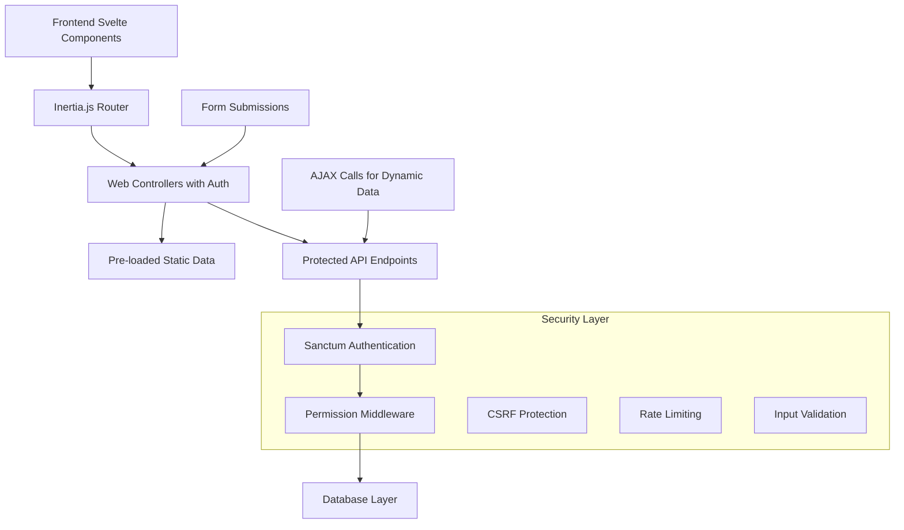

# Design Document

## Overview

This design document outlines the comprehensive security migration strategy for the Contalink Laravel application. The current system has critical vulnerabilities where API endpoints are unprotected and the frontend makes insecure AJAX calls. The solution involves a hybrid approach combining Inertia.js data pre-loading for static data and Sanctum-protected APIs for dynamic operations.

## Architecture

### Current Architecture Issues
- **Unprotected API Routes**: All `/api/*` routes except `/api/user` lack authentication
- **Mass Assignment Vulnerabilities**: Extensive use of `$request->all()` without validation
- **Insecure AJAX Calls**: Frontend components make direct calls to unprotected endpoints
- **Session Security**: Weak session and cookie configurations
- **Input Validation**: Inconsistent validation across controllers

### Target Architecture


## Components and Interfaces

### 1. Authentication & Authorization Layer

#### Sanctum Configuration
```php
// config/sanctum.php
'stateful' => explode(',', env('SANCTUM_STATEFUL_DOMAINS', 
    'localhost,localhost:3000,127.0.0.1,127.0.0.1:8000')),
'expiration' => 60, // 60 minutes
'token_prefix' => env('SANCTUM_TOKEN_PREFIX', 'contalink_'),
```

#### Middleware Stack
```php
// app/Http/Kernel.php
protected $middlewareGroups = [
    'api' => [
        'throttle:api',
        \Illuminate\Routing\Middleware\SubstituteBindings::class,
        'auth:sanctum', // Default authentication for API routes
    ],
    'web' => [
        // Existing web middleware
        'auth', // Ensure web routes are authenticated
        'permission', // Role-based permissions
    ],
];
```

### 2. Route Architecture Redesign

#### Protected API Routes Structure
```php
// routes/api.php
Route::middleware(['auth:sanctum', 'throttle:60,1'])->group(function () {
    // Dynamic search endpoints
    Route::get('/search/clients', [PersonsController::class, 'search'])
        ->middleware('permission:clients.index');
    Route::get('/search/products', [ProductsController::class, 'search'])
        ->middleware('permission:products.index');
    
    // Real-time data endpoints
    Route::get('/tills/{id}/amount', [TillsController::class, 'showTillAmount'])
        ->middleware('permission:tills.view');
    
    // Complex operations that need API access
    Route::post('/sales/validate', [SalesController::class, 'validateSale'])
        ->middleware('permission:sales.create');
});

// Authentication endpoints with stricter rate limiting
Route::middleware(['throttle:5,1'])->group(function () {
    Route::post('/register', [AuthController::class, 'create']);
});
```

#### Web Controllers for Form Handling
```php
// routes/web.php
Route::middleware(['auth', 'verified'])->group(function () {
    // Sales management
    Route::get('/sales/create', [SalesWebController::class, 'create'])
        ->middleware('permission:sales.create');
    Route::post('/sales', [SalesWebController::class, 'store'])
        ->middleware('permission:sales.create');
    
    // Purchases management
    Route::get('/purchases/create', [PurchasesWebController::class, 'create'])
        ->middleware('permission:purchases.create');
    Route::post('/purchases', [PurchasesWebController::class, 'store'])
        ->middleware('permission:purchases.create');
});
```

### 3. Data Pre-loading Strategy

#### Static Data Categories
- **Reference Data**: Payment types, IVA types, measurement units, categories, brands
- **User Context**: User permissions, assigned tills, person information
- **Configuration Data**: System settings, validation rules

#### Web Controller Implementation Pattern
```php
// app/Http/Controllers/Web/SalesWebController.php
class SalesWebController extends Controller
{
    public function create()
    {
        return Inertia::render('Sales/Form', [
            'staticData' => $this->getStaticData(),
            'userContext' => $this->getUserContext(),
            'formConfig' => $this->getFormConfiguration(),
        ]);
    }
    
    private function getStaticData(): array
    {
        return [
            'paymentTypes' => PaymentTypes::with('proofPayments')->get(),
            'ivaTypes' => IvaType::all(),
            'measurementUnits' => MeasurementUnit::where('is_active', true)->get(),
            'categories' => Categories::all(),
            'brands' => Brand::all(),
        ];
    }
    
    private function getUserContext(): array
    {
        $user = auth()->user();
        return [
            'user' => $user->load('person'),
            'permissions' => $user->getAllPermissions()->pluck('name'),
            'userTills' => $user->person?->tills ?? [],
        ];
    }
    
    private function getFormConfiguration(): array
    {
        return [
            'saleNumber' => $this->generateSaleNumber(),
            'defaultDate' => now()->format('Y-m-d'),
            'validationRules' => $this->getClientValidationRules(),
        ];
    }
}
```

### 4. Input Validation & Security

#### Form Request Classes
```php
// app/Http/Requests/SecureSalesRequest.php
class SecureSalesRequest extends FormRequest
{
    public function authorize(): bool
    {
        return $this->user()->can('sales.create');
    }
    
    public function rules(): array
    {
        return [
            'person_id' => 'required|exists:persons,id',
            'sale_date' => 'required|date|before_or_equal:today',
            'sale_number' => 'required|string|unique:sales,sale_number',
            'till_id' => 'required|exists:tills,id',
            'sale_details' => 'required|array|min:1',
            'sale_details.*.product_id' => 'required|exists:products,id',
            'sale_details.*.sd_qty' => 'required|numeric|min:0.01',
            'sale_details.*.sd_amount' => 'required|numeric|min:0.01',
            'proof_payments' => 'required|array|min:1',
            'proof_payments.*.payment_type_id' => 'required|exists:payment_types,id',
            'proof_payments.*.amount' => 'required|numeric|min:0.01',
        ];
    }
    
    public function validated($key = null, $default = null)
    {
        // Return only validated data, preventing mass assignment
        return parent::validated($key, $default);
    }
}
```

#### Model Protection
```php
// app/Models/Sales.php
class Sales extends Model
{
    protected $fillable = [
        'person_id',
        'sale_date', 
        'sale_number',
        // Explicitly define allowed fields
    ];
    
    protected $guarded = [
        'id',
        'created_at',
        'updated_at',
        // Protect sensitive fields
    ];
}
```

### 5. Frontend Component Architecture

#### Svelte Component Pattern
```javascript
// resources/js/Pages/Sales/Form.svelte
<script>
    import { useForm } from '@inertiajs/inertia-svelte';
    import { onMount } from 'svelte';
    
    // Props from Inertia pre-loading
    export let staticData;
    export let userContext;
    export let formConfig;
    
    // Destructure static data
    const { paymentTypes, ivaTypes, measurementUnits } = staticData;
    const { user, permissions, userTills } = userContext;
    
    // Form state management with Inertia
    let form = useForm({
        person_id: '',
        sale_date: formConfig.defaultDate,
        sale_number: formConfig.saleNumber,
        till_id: userTills.length === 1 ? userTills[0].id : '',
        sale_details: [],
        proof_payments: []
    });
    
    // Dynamic data functions (using protected APIs)
    async function searchClients(searchTerm) {
        if (searchTerm.length < 3) return [];
        
        try {
            const response = await axios.get('/api/search/clients', {
                params: { q: searchTerm },
                headers: {
                    'X-Requested-With': 'XMLHttpRequest'
                }
            });
            return response.data.data;
        } catch (error) {
            handleApiError(error);
            return [];
        }
    }
    
    // Form submission with Inertia
    function handleSubmit() {
        form.post('/sales', {
            onSuccess: (page) => {
                showSuccessMessage('Venta creada exitosamente');
            },
            onError: (errors) => {
                handleValidationErrors(errors);
            }
        });
    }
</script>
```

## Data Models

### Security-Enhanced Models

#### User Model Updates
```php
// app/Models/User.php
class User extends Authenticatable
{
    use HasApiTokens, HasFactory, Notifiable, HasRoles;
    
    protected $fillable = [
        'name',
        'email',
        'password',
        'person_id',
    ];
    
    protected $hidden = [
        'password',
        'remember_token',
    ];
    
    protected $casts = [
        'email_verified_at' => 'datetime',
        'password' => 'hashed',
    ];
    
    // Prevent mass assignment of sensitive fields
    protected $guarded = [
        'id',
        'email_verified_at',
        'remember_token',
    ];
}
```

#### Enhanced Product Model
```php
// app/Models/Products.php
class Products extends Model
{
    protected $fillable = [
        'product_name',
        'product_desc',
        'product_cost_price',
        'product_sale_price',
        'product_quantity',
        'category_id',
        'iva_type_id',
        'brand_id',
        'measurement_unit_id',
    ];
    
    protected $casts = [
        'product_cost_price' => 'decimal:2',
        'product_sale_price' => 'decimal:2',
        'product_quantity' => 'decimal:3',
        'is_active' => 'boolean',
    ];
    
    // Validation rules for quantity based on measurement unit
    public function validateQuantity(float $quantity): bool
    {
        return QuantityValidator::validate($quantity, $this->measurementUnit);
    }
}
```

## Error Handling

### Centralized Error Management
```php
// app/Exceptions/Handler.php
class Handler extends ExceptionHandler
{
    public function render($request, Throwable $exception)
    {
        // API error responses
        if ($request->expectsJson()) {
            return $this->handleApiException($request, $exception);
        }
        
        // Web error responses
        return $this->handleWebException($request, $exception);
    }
    
    private function handleApiException($request, $exception): JsonResponse
    {
        if ($exception instanceof ValidationException) {
            return response()->json([
                'message' => 'Los datos proporcionados no son válidos.',
                'errors' => $exception->errors(),
            ], 422);
        }
        
        if ($exception instanceof AuthenticationException) {
            return response()->json([
                'message' => 'No autenticado.',
            ], 401);
        }
        
        // Don't expose system details in production
        if (app()->environment('production')) {
            return response()->json([
                'message' => 'Error interno del servidor.',
            ], 500);
        }
        
        return response()->json([
            'message' => $exception->getMessage(),
        ], 500);
    }
}
```

### Custom Exception Classes
```php
// app/Exceptions/SecurityException.php
class SecurityException extends Exception
{
    public function render($request)
    {
        if ($request->expectsJson()) {
            return response()->json([
                'message' => 'Acceso denegado por razones de seguridad.',
            ], 403);
        }
        
        return redirect()->route('dashboard')
            ->with('error', 'Acceso denegado por razones de seguridad.');
    }
}
```

## Testing Strategy

### Security Testing Approach
1. **Authentication Tests**: Verify all API endpoints require authentication
2. **Authorization Tests**: Ensure proper permission checking
3. **Input Validation Tests**: Test mass assignment protection and validation rules
4. **CSRF Protection Tests**: Verify CSRF tokens are required and validated
5. **Rate Limiting Tests**: Confirm rate limits are enforced

### Test Structure
```php
// tests/Feature/SecurityTest.php
class SecurityTest extends TestCase
{
    use RefreshDatabase;
    
    public function test_api_routes_require_authentication()
    {
        $response = $this->getJson('/api/sales');
        $response->assertStatus(401);
    }
    
    public function test_mass_assignment_protection()
    {
        $user = User::factory()->create();
        
        $response = $this->actingAs($user)
            ->postJson('/api/users', [
                'name' => 'Test User',
                'email' => 'test@example.com',
                'is_admin' => true, // Should be ignored
            ]);
            
        $this->assertDatabaseMissing('users', [
            'email' => 'test@example.com',
            'is_admin' => true,
        ]);
    }
}
```

### Performance Testing
- **Load Testing**: Verify rate limiting doesn't impact legitimate users
- **Database Query Optimization**: Ensure pre-loading doesn't create N+1 queries
- **Memory Usage**: Monitor memory consumption with pre-loaded data

## Security Configuration

### Environment Variables
```env
# Application Security
APP_DEBUG=false
APP_ENV=production

# Session Security
SESSION_ENCRYPT=true
SESSION_SECURE_COOKIE=true
SESSION_HTTP_ONLY=true
SESSION_SAME_SITE=strict
SESSION_LIFETIME=60

# Sanctum Configuration
SANCTUM_EXPIRATION=60
SANCTUM_TOKEN_PREFIX=contalink_
SANCTUM_STATEFUL_DOMAINS=localhost,127.0.0.1

# Database Security
DB_CONNECTION=pgsql
# Use SSL in production
```

### Security Headers Middleware
```php
// app/Http/Middleware/SecurityHeaders.php
class SecurityHeaders
{
    public function handle($request, Closure $next)
    {
        $response = $next($request);
        
        $response->headers->set('X-Frame-Options', 'DENY');
        $response->headers->set('X-Content-Type-Options', 'nosniff');
        $response->headers->set('X-XSS-Protection', '1; mode=block');
        $response->headers->set('Referrer-Policy', 'strict-origin-when-cross-origin');
        
        if (app()->environment('production')) {
            $response->headers->set('Strict-Transport-Security', 'max-age=31536000; includeSubDomains');
        }
        
        return $response;
    }
}
```

## Migration Strategy

### Phase 1: Critical Security (Week 1)
1. **API Authentication**: Apply `auth:sanctum` middleware to all API routes
2. **Mass Assignment Protection**: Replace `$request->all()` with validated inputs
3. **Session Security**: Update session configuration
4. **Rate Limiting**: Implement rate limiting on critical endpoints

### Phase 2: Data Pre-loading (Week 2-3)
1. **Static Data Migration**: Move reference data to Inertia pre-loading
2. **Web Controllers**: Create secure web controllers for forms
3. **Frontend Updates**: Update Svelte components to use pre-loaded data
4. **Form Security**: Implement CSRF protection and validation

### Phase 3: Dynamic APIs (Week 4)
1. **Search APIs**: Secure and optimize search endpoints
2. **Real-time Data**: Implement protected APIs for dynamic operations
3. **Error Handling**: Standardize error responses
4. **Logging**: Implement security event logging

### Phase 4: Testing & Optimization (Week 5-6)
1. **Security Testing**: Comprehensive security test suite
2. **Performance Optimization**: Query optimization and caching
3. **Documentation**: Update API documentation
4. **Monitoring**: Implement security monitoring

## Conclusion

This design provides a comprehensive security migration strategy that addresses all identified vulnerabilities while maintaining existing functionality. The hybrid approach of Inertia.js pre-loading for static data and Sanctum-protected APIs for dynamic operations ensures both security and performance optimization.